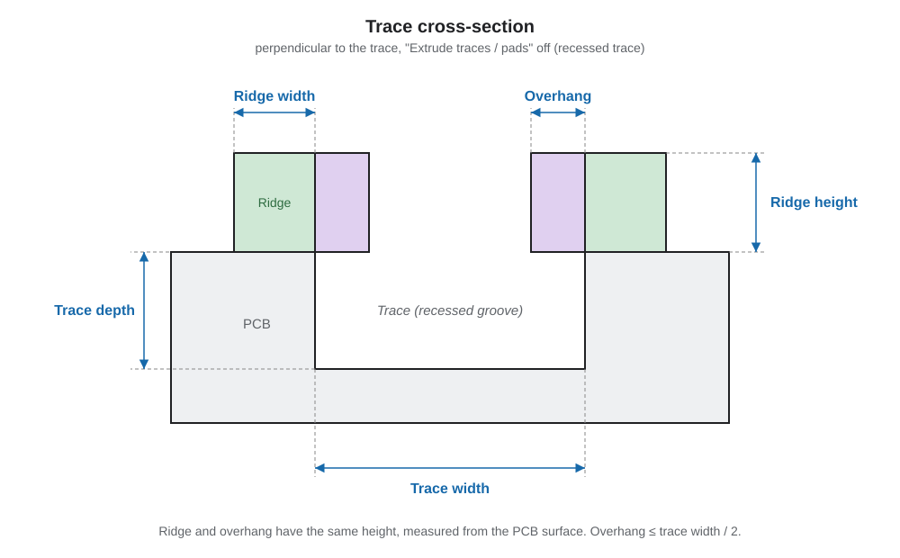

# PCB Etcher

PCB Etcher turns an SVG of a PCB design into a 3D-printable model, right in your browser. Load an SVG, adjust the settings, preview the result in 3D and download it as an STL file.

This tool is inspired by [PCB-forge](https://castpixel.itch.io/pcb-forge). But it was incompatible with my goals. So, now there is this PCB Etcher tool which allows you to create multiple types of PCB's:

1. With recessed traces and pads
2. With extruded traces and pads
3. With an overhang

## Overhang

The purpose of the overhang option is that you create traces for copper wire. I have tested with copper wire with a diameter of 0.5 mm, which works if the trace width is 0.7, width 0.5 and overhang 0.1mm. With a small screwdriver you can "click" the wire in place.

## Recessed or extruded traces

Based on the PCB forge version for copper tape. It allows you to print an Etcher model that will etch the copper onto the printed PCB.

I did not have had success with the PCB's because my traces where very small. I also used small copper tape, width < 5mm. It will probably work if the traces are with a width of >= 1mm and the copper tape will be ass wide as the PCB.

## Quick start

1. Open [PCBEtcher](https://skons.github.io/PCBEtcher/) in your browser.
2. Click **Choose SVG** and load your PCB design.
3. Set the colors so the tool knows what is an outer edge, trace, pad or hole (see [Colors](#colors)).
4. Set the size and thickness of the model (see [Model – PCB](#model--pcb)).
5. Click **Refresh 3D** to rebuild the preview after changes.
6. Click **Download PCB STL** or **Download etcher STL** to export the active model.

## Top bar

The top bar stays visible while you scroll and holds the main actions:

| Button | What it does |
| --- | --- |
| **Choose SVG** | Load the source SVG. |
| **Download PCB STL** / **Download etcher STL** | Export the active model as a 3D-printable STL file. |
| **Open settings** / **Save settings** | Load or save all settings as a JSON file. |
| **Reset settings** | Restore the default settings. |
| **Refresh 3D** | Rebuild the model after you changed settings. |
| **View original SVG** | Switch between the 3D preview and the original SVG. |
| **Help** | Opens this page. |

## SVG

Load the source file with **Choose SVG**. The colors in the SVG determine what counts as traces, pads and holes (see [Colors](#colors)).

## Colors

- **Outer edge**: the color of the outer outline of the PCB.
- **Traces / pads**: the color of the traces and pads. Add a trace / pad color for each SVG color that needs its own trace width, trace depth or height, pad diameter, or pad depth or height.
- **Hole colors**: link colors to holes with a diameter, for through-holes in the PCB.
- **Add trace / Pad Color**: allows to have different trace / pad widths on a single PCB.

## Model – PCB

- **PCB width / height**: set either one to scale the model while preserving its proportions.
- **Total thickness**: the thickness of the board.
- **Extrude traces / pads**:
  - *Off*: traces and pads are recessed grooves in the PCB. Their values are depths.
  - *On*: traces and pads are raised above the PCB. Their values are heights.
- **Mirror**: flips the generated PCB and the original SVG view.

The drawing below shows a cross-section of a recessed trace (perpendicular to the trace) and how the trace and ridge settings relate to each other.

### Ridge width / Ridge height

Set per trace / pad color. With **Extrude traces / pads** off, this adds a raised rim of the given width and height around that color's traces and pads.

- The rim always runs around the traces and pads, never across them.
- Through-holes stay open.
- Set the width or height to `0` for no rim.

### Overhang

Set per trace / pad color. Extends that color's ridge inward over its traces only, narrowing the open channel above the trace.

- It never covers pads, even where a trace runs straight into one.
- It floats above the recessed trace, attached only to the ridge on both sides.
- It can never be wider than half the trace width, so both sides can never overlap.
- Setting an overhang on any color **disables the Etcher model**, because the etch template cannot support this floating shape.

## Model – Etcher

Generates a template shape to hold the PCB in and etch it. It consists of:

- an outer wall on the outline,
- a base layer (infill),
- raised borders around traces, pads and holes that act as an etch mask.

### Base infill

- **Honeycomb**: the base layer is filled with a lightweight honeycomb pattern (less material, prints faster). It always stays within the outer edge.
- **Solid**: the base layer is one solid slab with no pattern. Sturdier, but uses more material.

### Etcher settings

- **Etcher thickness**: thickness of the base layer.
- **Etcher tolerance**: how much extra room the recesses for traces, pads and holes get compared to the PCB design, so the PCB fits in easily.
- **Cell size / wall width**: size and wall thickness of the honeycomb cells (Honeycomb only).

## Mesh

- **Arc segment resolution**: how many segments round shapes (pads and holes) get. Higher is smoother but heavier to render.

**Refresh 3D** rebuilds the model after changes. The download buttons export the active model as a 3D-printable STL file.

# Known issues

- The 3d image does not render the PCB properly. Use a slicer to view the SVG properly.
- Small ridges will render in Bambustudio, but will not be sliced into printed ridges. Widen your ridges.
